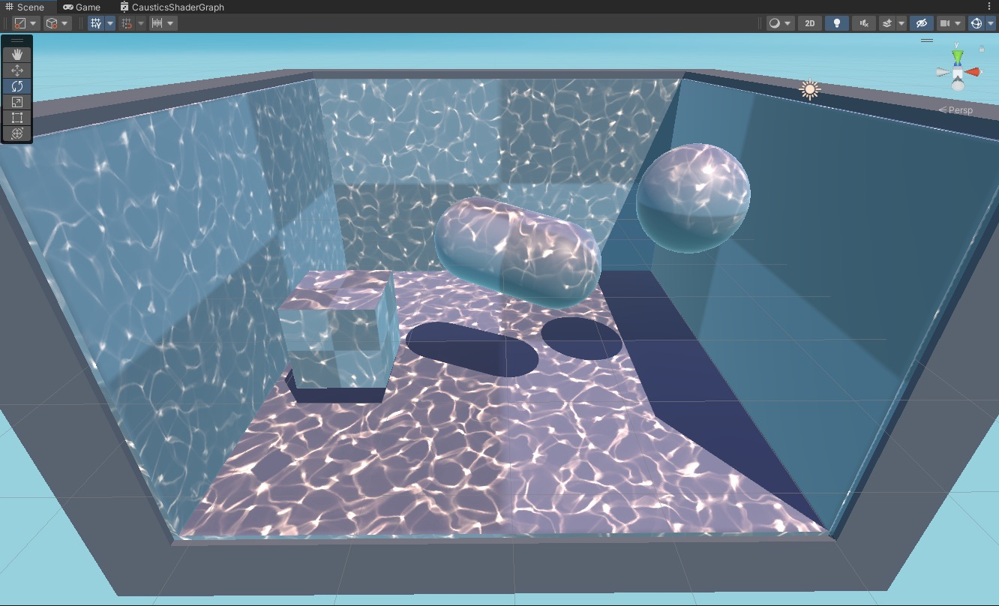
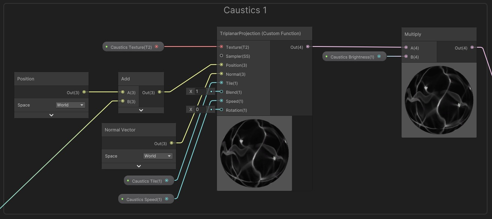
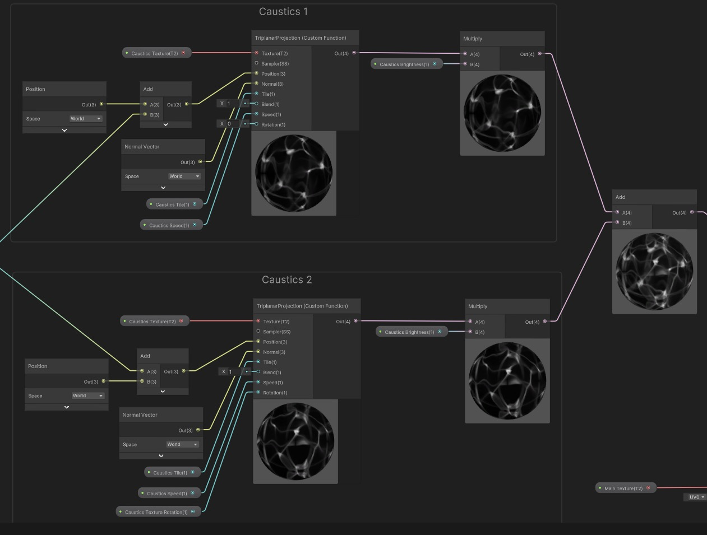
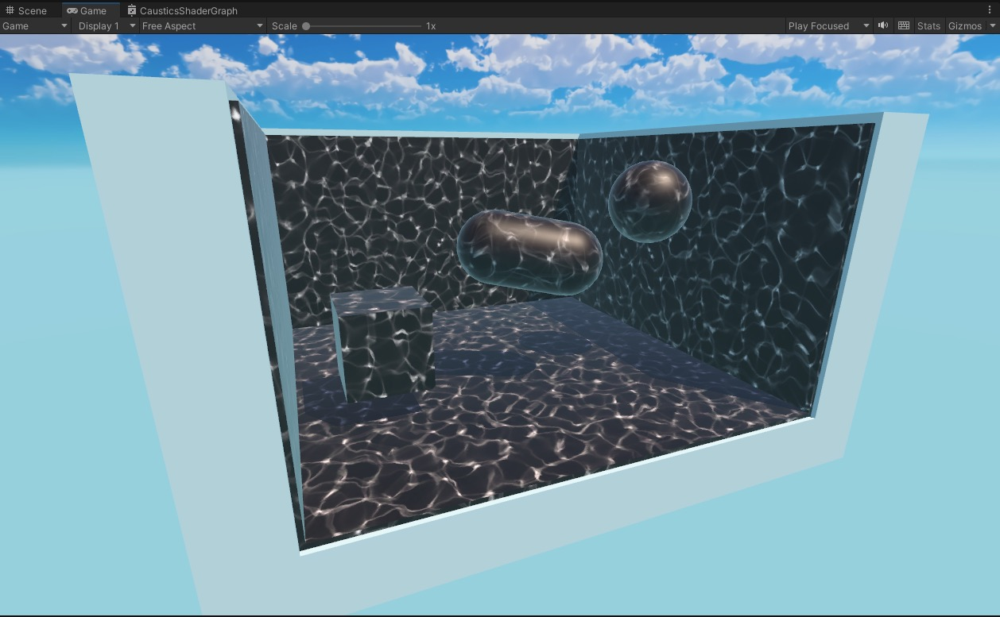
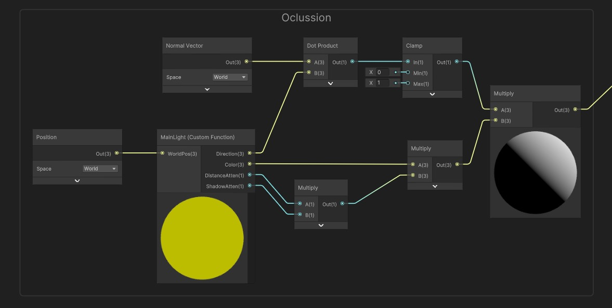
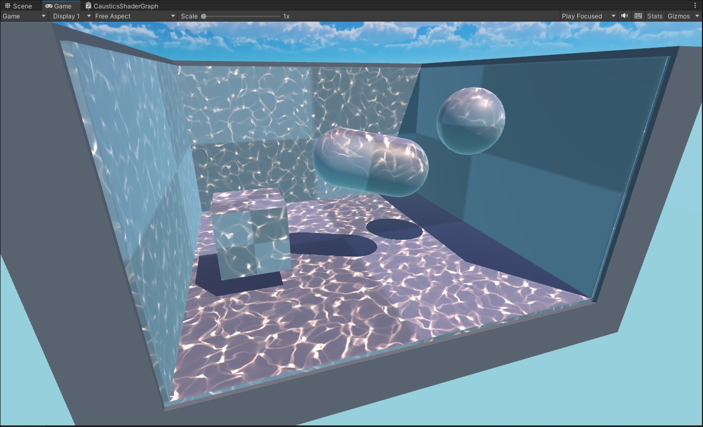
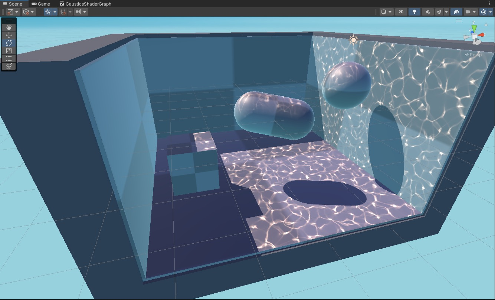
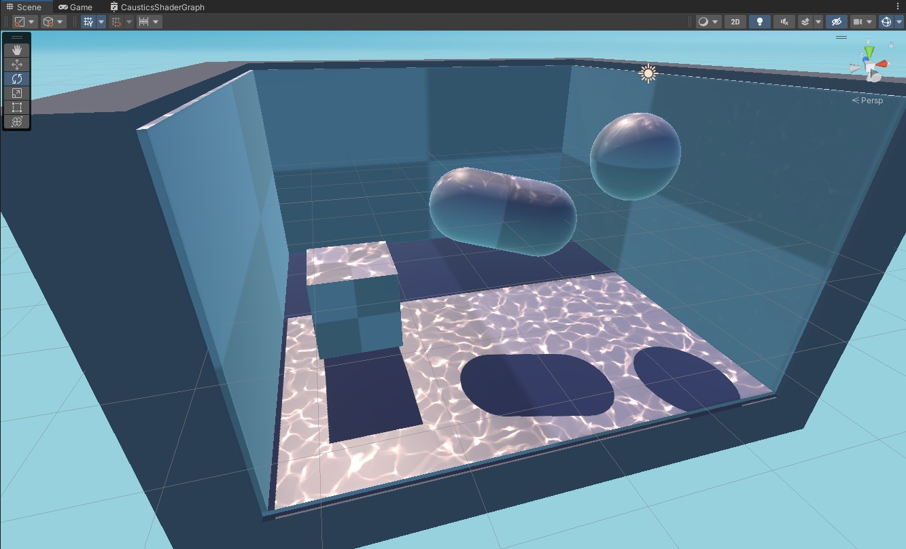
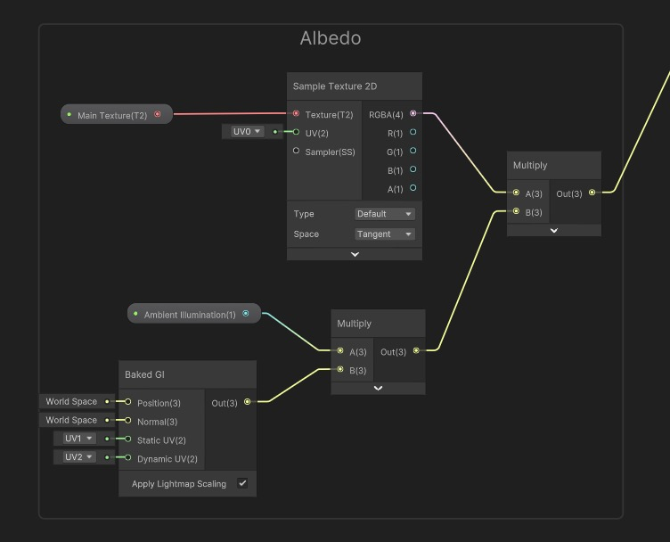
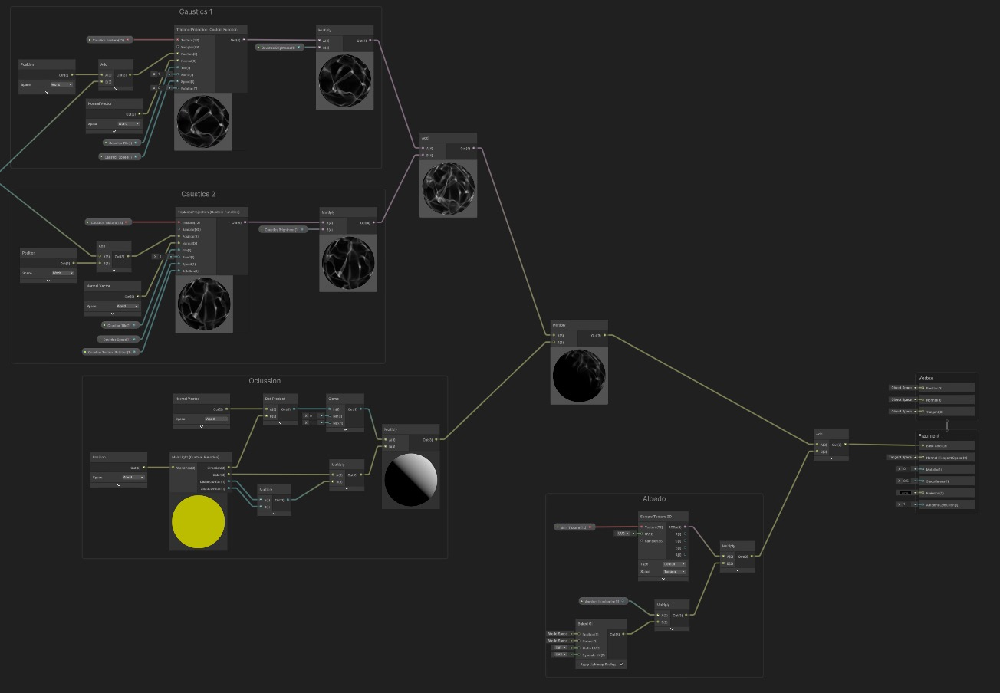

# Water Caustics Shader

Water Caustics Shader implemented with Shader Graph in **Unity 2021.3.10f1**

## Screenshots



## Table of Content

- [Scene Setup](#scene-setup)
- [HLSL](#hlsl)
  - [Main Light](#main-light)
  - [UV Rotation](#uv-rotation)
  - [Triplanar Projection](#triplanar-projection)
- [Shader Graph](#shader-graph)
  - [Caustics Tiling and Speed](#caustics-tiling-and-speed)
  - [Caustics Texture Rotation](#caustics-texture-rotation)
  - [Caustics Distortion](#caustics-distortion)
  - [Caustics Distorted Triplanar](#caustics-distorted-triplanar)
  - [Caustics End Result](#caustics-end-result)
  - [Additive Caustics](#additive-caustics)
  - [Oclussion](#oclussion)
    - [Oclussion Screenshots](#oclussion-screenshots)
  - [Global Illumination](#global-illumination)
  - [Complete Graph](#complete-graph)

## Resources

- [Custom Lighting in Shader Graph](https://blog.unity.com/technology/custom-lighting-in-shader-graph-expanding-your-graphs-in-2019)
- [Caustics Texture](https://graphicdesign.stackexchange.com/questions/4725/how-can-i-create-a-large-size-water-caustics-texture-for-animation)
- [Stylized Skybox](https://assetstore.unity.com/packages/2d/textures-materials/sky/free-stylized-skybox-212257)

### HLSL Resources

- [Triplanar ShaderGraph Node HLSL code](https://docs.unity3d.com/Packages/com.unity.shadergraph@12.1/manual/Triplanar-Node.html)
- [UV Rotation ShaderGraph Node HLSL code](https://docs.unity3d.com/Packages/com.unity.shadergraph@12.1/manual/Rotate-Node.html)

## Scene Setup

- Built a basic pool and put some primitive objects inside.
- Used the stlylized skybox to make the scene look more polished.


## HLSL

### Main Light

- Based on the example for implementing [custom lighting in Shader Graph](https://blog.unity.com/technology/custom-lighting-in-shader-graph-expanding-your-graphs-in-2019), we define the custom HLSL function to get the main light.
- `SHADERGRAPH_PREVIEW` will be true while developing the shader in the Shader Graph node editor.

```c
void MainLight_half(
    in float3 WorldPos,
    out half3 Direction,
    out half3 Color,
    out half DistanceAtten,
    out half ShadowAtten
)
{
    #if SHADERGRAPH_PREVIEW
        Direction = half3(0.5, 0.5, 0);
        Color = 1;
        DistanceAtten = 1;
        ShadowAtten = 1;
    #else
        #if SHADOWS_SCREEN
            half4 clipPos = TransformWorldToHClip(WorldPos);
            half4 shadowCoord = ComputeScreenPos(clipPos);
        #else
            half4 shadowCoord = TransformWorldToShadowCoord(WorldPos);
        #endif

        Light mainLight = GetMainLight(shadowCoord);
        Direction = mainLight.direction;
        Color = mainLight.color;
        DistanceAtten = mainLight.distanceAttenuation;
        ShadowAtten = mainLight.shadowAttenuation;
    #endif
}
```

### UV Rotation

- Simply a copy paste of the HLSL code from the documentation for the [Shader Graph Node to do UV roation](https://docs.unity3d.com/Packages/com.unity.shadergraph@12.1/manual/Rotate-Node.html).

```c
float2 Unity_Rotate_Degrees_float(float2 UV, float2 Center, float Rotation)
{
    Rotation = Rotation * (3.1415926f/180.0f);
    UV -= Center;

    float s = sin(Rotation);
    float c = cos(Rotation);

    float2x2 rMatrix = float2x2(c, -s, s, c);

    rMatrix *= 0.5;
    rMatrix += 0.5;
    rMatrix = rMatrix * 2 - 1;

    UV.xy = mul(UV.xy, rMatrix);
    UV += Center;

    return UV;
}
```

### Triplanar Projection

- Based on the HLSL code from the [Shader Graph Node to do Triplanar Projection](https://docs.unity3d.com/Packages/com.unity.shadergraph@12.1/manual/Triplanar-Node.html).
- The modifications for this include passing in a **Speed** and **Rotation** for the UVs.
- The **offset** will be calculated with **Time** and **Speed**.
- The **rotation** will be used with the previously defined HLSL function.
- This returns a **projection** based on the **world position** of the **vertices**, using each **plane** as an **UV mapping**.
  - This means the **projection** will always be the same, no matter the shape or position of the object.
  - There will be a **blending** done using the Normals orientation and a blend parameter.

```c
void TriplanarProjection_float(
    in Texture2D Texture,
    in SamplerState Sampler,
    in float3 Position,         // world space
    in float3 Normal,           // world space
    in float Tile,
    in float Blend,

    // UV manipulation
    in float Speed,
    in float Rotation,

    out float4 Out
)
{
    float3 Node_UV = Position * Tile;

    // animate UVs
    float Offset_UV = _Time.y * Speed;

    float3 Node_Blend = pow(abs(Normal), Blend);
    Node_Blend /= dot(Node_Blend, 1.0);

    float4 Node_X = SAMPLE_TEXTURE2D(Texture, Sampler, Unity_Rotate_Degrees_float(Node_UV.zy, 0, Rotation) + Offset_UV);
    float4 Node_Y = SAMPLE_TEXTURE2D(Texture, Sampler, Unity_Rotate_Degrees_float(Node_UV.xz, 0, Rotation) + Offset_UV);
    float4 Node_Z = SAMPLE_TEXTURE2D(Texture, Sampler, Unity_Rotate_Degrees_float(Node_UV.xy, 0, Rotation) + Offset_UV);

    Out = Node_X * Node_Blend.x + Node_Y * Node_Blend.y + Node_Z * Node_Blend.z;
}
```

## Shader Graph

### Caustics Tiling and Speed

- Define a **Custom Function** **Node** using the **Triplanar Projection** we defined in **HLSL**.
- Set a **Caustics Texture**, a **Tiling** and a **Speed** for the **Offset** of the **UVs**.



### Caustics Texture Rotation

- Make one of the Caustic Textures **rotated** by the amount determined by **Caustic Texture Rotation**.



### Caustics Distortion

- Use the **Caustics Distortion Speed** multiplied by **Time**, to offset a **Vector2** composed by the **RG** channels of the **World Position** of the vertices.
- Divide by **Caustics Distortion Factor**, to further modify the distortion.

- Use **Caustics Distortion Scale** to control the scale of the noise.


<!-- 5.mp4 -->

https://user-images.githubusercontent.com/4588601/211901682-5cbfd3ca-0a71-4f15-9897-67d1f4868c0e.mp4

### Caustics Distorted Triplanar

- Use the **distorted** **World Position** of the vertices as input to **sample** the **Triplanar Projection**.


### Caustics End Result

- The end result simulates the caustics of the water surface, but a much lower computational cost.



<!-- 1.mp4 -->

https://user-images.githubusercontent.com/4588601/211900812-34b712c9-1257-4040-b864-cac7d016a8e0.mp4

### Additive Caustics

- **Add** the **caustics color** to a **primary Texture**, to **overlay** on top of whatever color the object has.


<!-- 6.mp4 -->

https://user-images.githubusercontent.com/4588601/211900916-0e3bea64-8756-44cb-83bf-23b42d215aae.mp4

### Oclussion

- Use a **Custom Function Node** to execute the **MainLight** **HLSL** function we wrote earlier.
- Get the **Direction**, **Color**, **Distance Attenuation** and **Shadow Attenuation** for the main light.
- Calculate a simple **Lambert shading** using the **dot** product of the **light direction** and the **Normal Vector**.
- Multiply the **Distance** and **Shadow Attenuations** by the **Color** of the light.
- Multiply everything together to calculate a **colorized oclussion mask** for the **caustics**.



#### Oclussion Screenshots

- Using different angles of light.





### Global Illumination

- Use the **Baked GI Node** to access the **Ambient/Global Illumination** from the Scene.
- Multiply it by the **Albedo** color coming from the **Main Texture**.



### Complete Graph

- Multiply the **Oclussion** by the **Caustics** to mask it out.
- Multiply the **Ocluded Caustics** by the **Albedo + Global Illumination**.


